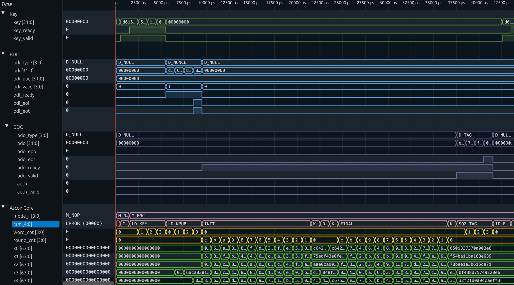

# Hardware Design of Ascon (SP 800-232)

[Ascon](https://ascon.iaik.tugraz.at) is a family of authenticated encryption and hashing algorithms designed to be lightweight and easy to implement, even with added countermeasures against side-channel attacks. Ascon has been selected as new standard for lightweight cryptography in the [NIST Lightweight Cryptography competition](https://csrc.nist.gov/Projects/Lightweight-Cryptography) (2019–2023). The current draft standard of Ascon is available [here](https://doi.org/10.6028/NIST.SP.800-232.ipd).

> [!NOTE]
> This is a work-in-progress SystemVerilog implementation of the Ascon family of lightweight cryptographic algorithms that is compatible with the current draft standard [NIST SP 800-232](https://doi.org/10.6028/NIST.SP.800-232.ipd).

The following Ascon modes are available:
- `Ascon-AEAD128`
- `Ascon-Hash256`
- `Ascon-XOF128`
- `Ascon-CXOF128`

## Available Variants

The Ascon core can be configured to support the following combinations of data-bus width and unrolled rounds of Ascon-p:

| **Variant** | **Bus Width** | **Unrolling** |
|-------------|:-------------:|:-------------:|
| **v1**      |     32-bit    |       1       |
| **v2**      |     32-bit    |       2       |
| **v3**      |     32-bit    |       4       |
| **v4**      |     64-bit    |       1       |
| **v5**      |     64-bit    |       2       |
| **v6**      |     64-bit    |       4       |

## Performance

Cycles required for processing **x** bytes of message and **y** bytes of associated data:

| **Variant** | **Mode**        | **( x=0, y=0 )** | **( x=32, y=32 )** | **( x=1024, y=1024 )** |
|-------------|-----------------|:----------------:|:------------------:|:----------------------:|
| **v1**      | `Ascon-AEAD128` |         41       |          99        |           1587         |
| **v2**      | `Ascon-AEAD128` |         29       |          67        |           1059         |
| **v3**      | `Ascon-AEAD128` |         23       |          51        |            795         |
| **v4**      | `Ascon-AEAD128` |         35       |          85        |           1325         |
| **v5**      | `Ascon-AEAD128` |         23       |          53        |            797         |
| **v6**      | `Ascon-AEAD128` |         17       |          37        |            533         |

Cycles required for processing **x** bytes of message:

| **Variant** | **Mode**        | **( x=0 )** | **( x=32 )** | **( x=1024 )** |
|-------------|-----------------|:-----------:|:------------:|:--------------:|
| **v1**      | `Ascon-Hash256` |      70     |      126     |      1862      |
| **v2**      | `Ascon-Hash256` |      40     |       72     |      1064      |
| **v3**      | `Ascon-Hash256` |      25     |       45     |       665      |
| **v4**      | `Ascon-Hash256` |      66     |      118     |      1730      |
| **v5**      | `Ascon-Hash256` |      36     |       64     |       932      |
| **v6**      | `Ascon-Hash256` |      21     |       37     |       533      |

## Files

- `rtl/`: SystemVerilog implementation of the Ascon core.
- `surfer/`: Files for the [Surfer](https://surfer-project.org/) waveform viewer.
- `synth/`: Files for [Yosys](https://github.com/YosysHQ/yosys) synthesis.
- `ascon.py`: Python reference implementation of Ascon, used by `test.py`.
- `CITATION.cff`: Github citation information file.
- `LICENSE`: License file.
- `Makefile`: Makefile for rtl simulation, rtl synthesis, and waveform viewing.
- `README.md`: This README.
- `test.py`: Python script for running the [cocotb](https://www.cocotb.org/) test bench.

## Interface

The following table contains a description of the interface signals:

| **Name**     | **Bits** | **Description**                                  |
|--------------|:--------:|--------------------------------------------------|
| `clk`        |     1    | Clock signal.                                    |
| `rst`        |     1    | Reset signal. Note: Synchronous active high.     |
| `key`        |   32/64  | Key data input.                                  |
| `key_valid`  |     1    | Key data is valid.                               |
| `key_ready`  |     1    | Ascon core is ready to receive a new key.        |
| `bdi`        |   32/64  | Block data input (BDI).                          |
| `bdi_valid`  |    4/8   | Valid BDI data bytes.                            |
| `bdi_ready`  |     1    | Ascon core is ready to receive data.             |
| `bdi_eot`    |     1    | Last BDI block of this type.                     |
| `bdi_eoi`    |     1    | Last BDI block.                                  |
| `bdi_type`   |     4    | Type of BDI data.                                |
| `mode`       |     4    | Ascon mode.                                      |
| `bdo`        |   32/64  | Block data output (BDO).                         |
| `bdo_valid`  |    4/8   | Valid BDO data bytes.                            |
| `bdo_ready`  |     1    | Test bench is ready to receive data.             |
| `bdo_type`   |     4    | Type of BDO data.                                |
| `bdo_eoo`    |     1    | Last BDO block.                                  |
| `auth`       |     1    | Authentication success.                          |
| `auth_valid` |     1    | Authentication output is valid.                  |

## RTL Simulation

- Install the Verilator open-source verilog simulator (tested with version `5.034`):
  - Ubuntu:
    - `apt-get install verilator`
  - Fedora:
    - `dnf install verilator`
    - `dnf install verilator-devel`
  - Build from source:
    - [Git Quick Install](https://verilator.org/guide/latest/install.html#git-quick-install)
- Install the [cocotb](https://www.cocotb.org/) open-source verilog test bench environment:
  - `pip install cocotb`
- Execute the cocotb test bench:
  - `make` or `make sim`

## RTL Synthesis

- Install the Yosys open-source synthesis suite (tested with version `0.53`):
  - Ubuntu:
    - `apt-get install yosys`
  - Fedora:
    - `dnf install yosys`
- Execute the yosys synthesis script:
  - `make synth`

## RTL Post-Synthesis Simulation

- Execute the yosys synthesis script:
  - `make synth`
- Execute the cocotb test bench for synthesized RTL:
  - `make sim synth=1`

## View Waveforms

- Install the [Surfer](https://surfer-project.org/) waveform viewer.
  - `cargo install --git https://gitlab.com/surfer-project/surfer surfer`
- View waveform of cocotb test bench run:
  - `make sim`
  - `make surf`
- View waveform of post-synthesis cocotb test bench run:
  - `make synth`
  - `make sim synth=1`
  - `make surf synth=1`
- Example waveform of test bench output:

## Integration

- The Ascon core uses an interface that allows easy integration into projects using, e.g., an AXI4 bus.
- The Ascon core can handle stalls of the input/output data bus. This can be tested by setting `STALLS = 1` in `test.py`.
- Many ciphers, including Ascon, require that decrypted plaintext is not released to an potential attacker until the tag of the ciphertext was successfully verified. The current design of the Ascon core outputs decrypted plaintext immediately which could lead to security degradation. For real applications an additional buffer should be used to temporarily store decrypted plaintext until the Ascon core has successfully verified the ciphertext tag.

## Contact

- Robert Primas (rprimas 'at' proton.me, https://rprimas.github.io)

## Acknowledgements

The interface of the Ascon core is inspired by the [LWC Hardware API Development Package](https://github.com/GMUCERG/LWC) that was mainly developed by the [Cryptographic Engineering Research Group](https://cryptography.gmu.edu) at George Mason University (GMU).
