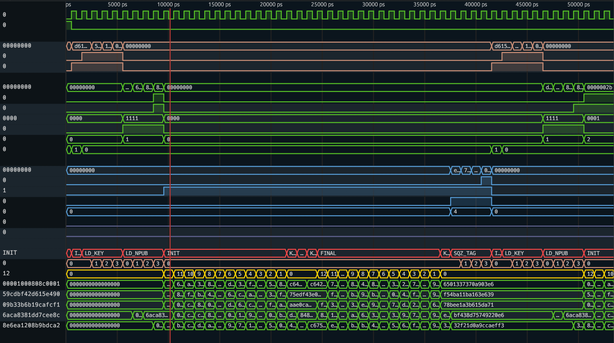

# Hardware Design of Ascon (SP 800-232)

[Ascon](https://ascon.iaik.tugraz.at) is a family of authenticated encryption and hashing algorithms designed to be lightweight and easy to implement, even with added countermeasures against side-channel attacks. Ascon has been selected as new standard for lightweight cryptography in the [NIST Lightweight Cryptography competition](https://csrc.nist.gov/Projects/Lightweight-Cryptography) (2019–2023). The current draft standard of Ascon is available [here](https://doi.org/10.6028/NIST.SP.800-232.ipd).

> [!NOTE]
> This is a work-in-progress hardware implementation of the Ascon family of lightweight cryptographic algorithms that is compatible with the current draft standard [NIST SP 800-232](https://doi.org/10.6028/NIST.SP.800-232.ipd).

## Available Variants

The Ascon hardware design can be configured to one out of six variants.
All variants support the following Ascon modes:
  - `Ascon-AEAD128`
  - `Ascon-Hash256`
  - `Ascon-XOF128`
  - `Ascon-CXOF128`

The specific variants support the following combination of data-bus width and unrolled permutation rounds:

| **Variant** | **Bus Width** | **Rounds/Cycle** |
|-------------|:-------------:|:----------------:|
| **v1**      |     32-bit    |         1        |
| **v2**      |     32-bit    |         2        |
| **v3**      |     32-bit    |         4        |
| **v4**      |     64-bit    |         1        |
| **v5**      |     64-bit    |         2        |
| **v6**      |     64-bit    |         4        |

## Performance

The following table shows the cycles required for processing **x** bytes of message and **y** bytes of associated data **(x,y)**:

| **Variant** | **Mode**        | **(0,0)** | **(16,16)** | **(1536,1536)** |
|-------------|-----------------|:---------:|:-----------:|:---------------:|
| **v1**      | `Ascon-AEAD128` |     41    |     75      |      2355       |
| **v2**      | `Ascon-AEAD128` |     29    |     51      |      1571       |
| **v3**      | `Ascon-AEAD128` |     23    |     39      |      1179       |
| **v4**      | `Ascon-AEAD128` |     35    |     65      |      1965       |
| **v5**      | `Ascon-AEAD128` |     23    |     41      |      1181       |
| **v6**      | `Ascon-AEAD128` |     17    |     29      |       789       |

## Files

- `rtl/ascon_core.sv`: Implementation of the Ascon core.
- `rtl/asconp.sv`: Implementation of the Ascon permutation.
- `rtl/config.sv`: Configuration of the Ascon core.
- `rtl/functions.sv`: Some generic verilog functions.
- `ascon.py`: Reference software implementation of Ascon, used by `test.py`.
- `LICENSE`: License file.
- `Makefile`: Commands for running [cocotb](https://www.cocotb.org/) verilator test bench.
- `README.md`: This README.
- `surfer.ron`: Configuration file for the [Surfer](https://surfer-project.org/) waveform viewer.
- `test.py`: Python script for running test bench, used by cocotb.

## Interface

The following table contains a description of the interface signals:

| **Name**     | **Bits** | **Description**                                  |
|--------------|:--------:|--------------------------------------------------|
| `clk`        |     1    | Clock signal.                                    |
| `rst`        |     1    | Reset signal. Note: Synchronous active high.     |
| `key`        |   32/64  | Key data input.                                  |
| `key_valid`  |     1    | Key data is valid.                               |
| `key_ready`  |     1    | Ascon core is ready to receive a new key.        |
| `bdi`        |   32/64  | Block data input (BDI).                          |
| `bdi_valid`  |    4/8   | Valid BDI data bytes.                            |
| `bdi_ready`  |     1    | Ascon core is ready to receive data.             |
| `bdi_eot`    |     1    | Last BDI block of this type.                     |
| `bdi_eoi`    |     1    | Last BDI block.                                  |
| `bdi_type`   |     4    | Type of BDI data.                                |
| `mode`       |     4    | Ascon mode.                                      |
| `bdo`        |   32/64  | Block data output (BDO).                         |
| `bdo_valid`  |    4/8   | Valid BDO data bytes.                            |
| `bdo_ready`  |     1    | Test bench is ready to receive data.             |
| `bdo_type`   |     4    | Type of BDO data.                                |
| `bdo_eoo`    |     1    | Last BDO block.                                  |
| `auth`       |     1    | Authentication success.                          |
| `auth_valid` |     1    | Authentication output is valid.                  |

## Quick Start

- Install the Verilator open-source verilog simulator (tested with `v5.030`):
  - Ubuntu:
    - `apt-get install verilator`
  - Fedora:
    - `dnf install verilator`
    - `dnf install verilator-devel`
  - Build from source:
    - [Git Quick Install](https://verilator.org/guide/latest/install.html#git-quick-install)
- Install the [cocotb](https://www.cocotb.org/) open-source verilog test bench environment:
  - `pip install cocotb`
- Execute the cocotb test bench:
  - `make`

## View Waveforms

- Install the [Surfer](https://surfer-project.org/) waveform viewer.
  - `cargo install --git https://gitlab.com/surfer-project/surfer surfer`
- View waveform of cocotb test bench run:
  - `make surf`
- Example waveform output of test bench:

## Contact

- Robert Primas (rprimas 'at' proton.me, https://rprimas.github.io)

## Acknowledgements

The interface of the Ascon core is inspired by the [LWC Hardware API Development Package](https://github.com/GMUCERG/LWC) that was mainly developed by the [Cryptographic Engineering Research Group](https://cryptography.gmu.edu) at George Mason University (GMU).
