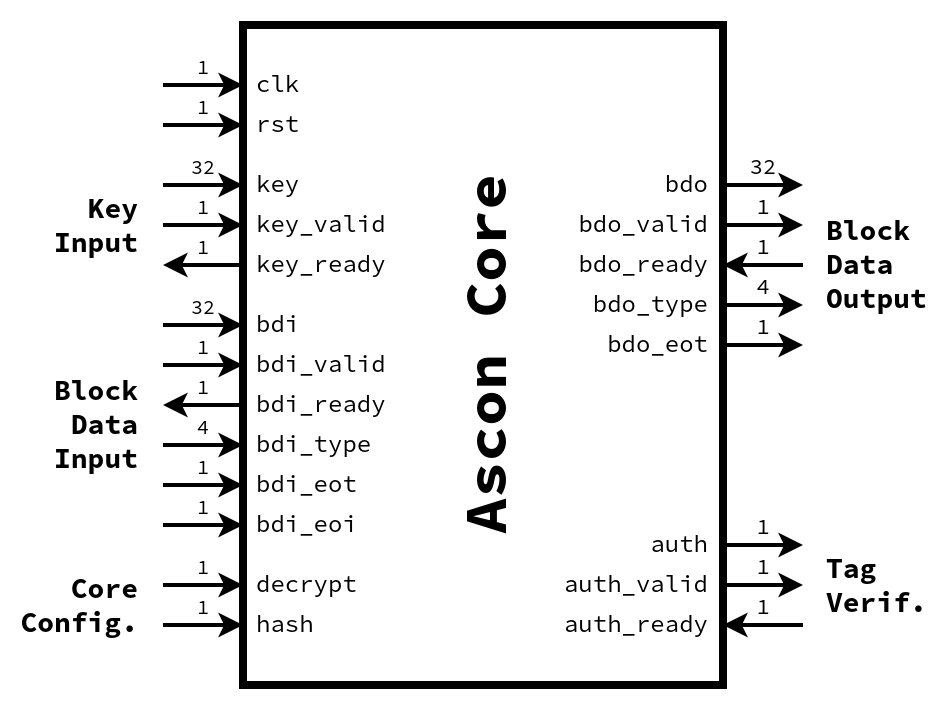

# Hardware Design of [Ascon-128 and Ascon-Hash (v1.2)](https://ascon.iaik.tugraz.at)

[Ascon](https://ascon.iaik.tugraz.at) is a family of authenticated encryption and hashing algorithms designed to be lightweight and easy to implement, even with added countermeasures against side-channel attacks. Ascon has been selected as new standard for lightweight cryptography in the [NIST Lightweight Cryptography competition](https://www.nist.gov/news-events/news/2023/02/nist-selects-lightweight-cryptography-algorithms-protect-small-devices) (2019–2023). Ascon has also been selected as the primary choice for lightweight authenticated encryption in the final portfolio of the [CAESAR competition](https://competitions.cr.yp.to/caesar.html) (2014-2019).

This verilog implementation of Ascon is similar to my [previous VHDL implementation](https://github.com/ascon/ascon-hardware). The verilog version uses a simpler interface that considerably reduces the size of the code base. The main interface changes are:
- Some signals have been removed (see [Interface](#Interface) section).
- Bus width is fixed to 32 bits.
- Padding of inputs/outputs is shifted to software.

Besides the interface changes, this code base comes with:
- A more permissive CC0 license.
- A low amount of external dependencies, i.e., Python, Icarus Verilog, and optionally GTKWave.
- Easy instructions for simulation/debugging using open-source tools.

## Available Variants

- **v1**
  - Ascon-128 + Ascon-Hash.
  - 32-bit block data interface.
  - 1 permutation round per clock cycle.
- **v2**
  - Ascon-128 + Ascon-Hash.
  - 32-bit block data interface.
  - 2 permutation rounds per clock cycle.
- **v3**
  - Ascon-128 + Ascon-Hash.
  - 32-bit block data interface.
  - 3 permutation rounds per clock cycle.

## Files

- `rtl/ascon_core.sv`: Verilog implementation of the Ascon core.
- `rtl/asconp.sv`: Verilog implementation of the Ascon permutation.
- `rtl/config_core.sv`: Configuration file for the Ascon core and test bench.
- `rtl/config_v*.sv`: Configuration file for the Ascon core.
- `rtl/tb.sv`: Verilog test bench for the Ascon core.
- `tv/*`: Test vector files for the verilog test bench.
- `LICENSE`: License file.
- `Makefile`: Commands for running verilog test bench and optionally showing wave forms in GTKWave.
- `README.md`: This README.
- `ascon.py`: Python software implementation of Ascon, used by `run_tb.py`.
- `config.gtkw`: Optional configuration file for the GTKWave waveform viewer.
- `run_tb.py`: Python script for running Ascon in both verilog/python and comparing the results.

## Interface

The interface of the Ascon core is similar to [GMU's crypto core interface (Figure 5.1)](https://cryptography.gmu.edu/athena/LWC/LWC_HW_Implementers_Guide.pdf) that was often used during the [NIST standardization for lightweight authenticated encryption](https://csrc.nist.gov/projects/lightweight-cryptography/).
The following changes to the GMU crypto core interface were made:
- Removed signals:
  - `bdi_valid_bytes`, `bdi_pad_loc`, `bdi_size`
  - `fdi_ready`, `fdi_valid`, `fdi_data`
  - `fdo_ready`, `fdo_valid`, `fdo_data`
  - `bdo_valid_bytes`, `end_of_block`, `key_update`
- Renamed signals:
  - `decrypt_in` -> `decrypt`
  - `hash_in` -> `hash`
  - `msg_auth`, `msg_auth_valid`, `msg_auth_ready` -> `auth`, `auth_valid`, `auth_ready` 

The resulting (simplified) interface of the Ascon core is shown here:

The following table contains a description of the interface signals:

| **Name**   | **Description**                                                              |
| ---------- | ---------------------------------------------------------------------------- |
| clk        | Clock signal.                                                                |
| rst        | Reset signal. Note: Synchronous active high.                                 |
| key        | Key data input.                                                              |
| key_valid  | Key data is valid.                                                           |
| key_ready  | Ascon core is ready to receive a new key.                                    |
| bdi_data   | Block data input (BDI).                                                      |
| bdi_valid  | BDI data is valid.                                                           |
| bdi_ready  | Ascon core is ready to receive data.                                         |
| bdi_eot    | The current BDI block is the last block of its type.                         |
| bdi_eoi    | The current BDI block is the last block of input other than the tag segment. |
| bdi_type   | Type of BDI data. See `rtl/config.sv`.                                       |
| decrypt    | 0=Encryption, 1=Decryption.                                                  |
| hash       | 0=Encryption/Decryption, 1=Hash.                                             |
| bdo_data   | Block data output (BDO).                                                     |
| bdo_valid  | BDO data is valid.                                                           |
| bdo_ready  | Test bench is ready to receive data.                                         |
| bdo_type   | Type of BDO data. See `rtl/config.sv`.                                       |
| auth       | 1=Authentication success, 0=Authentication failure.                          |
| auth_valid | Authentication output is valid.                                              |
| auth_ready | Test bench is ready to accept authentication result.                         |

You can have a look at `rtl/tb.sv` for an example of how the Ascon core interface can be used.

## Quick Start

- Install the Icarus Verilog (iverilog) open-source verilog simulator:
  - See `https://steveicarus.github.io/iverilog/usage/installation.html`.
  - Tested with version 12.0 and flags `-g2005-sv`, `-g2009`, and `-g2012`.
- Execute verilog test bench:
  - `make` (runs `rtl/tb.sv` using `tv/tv.txt` as input).
- Execute verilog test bench and show resulting wave forms:
  - `make wave` (same as `make` but also opens resulting `tb.vcd` in GTKWave).

## Automatic Generation and Execution of Test Vectors

- `python tb.py -s` (add `-v 2` or `-v 3` for other variants)
  - Generate a new `tv/tv.txt`, run `rtl/tb.sv`, and compare output to Ascon software implementation in `ascon.py`.
- `python tb.py -w` (add `-v 2` or `-v 3` for other variants)
  - Same as `python tb.py -s` except the entire process is repeated for many inputs with different lengths.

## Contact

- Robert Primas (rprimas 'at' proton.me, https://rprimas.github.io)

## Acknowledgements

The interface of the Ascon core is inspired by the [LWC Hardware API Development Package](https://github.com/GMUCERG/LWC) that was mainly developed by the [Cryptographic Engineering Research Group](https://cryptography.gmu.edu) at George Mason University (GMU).
